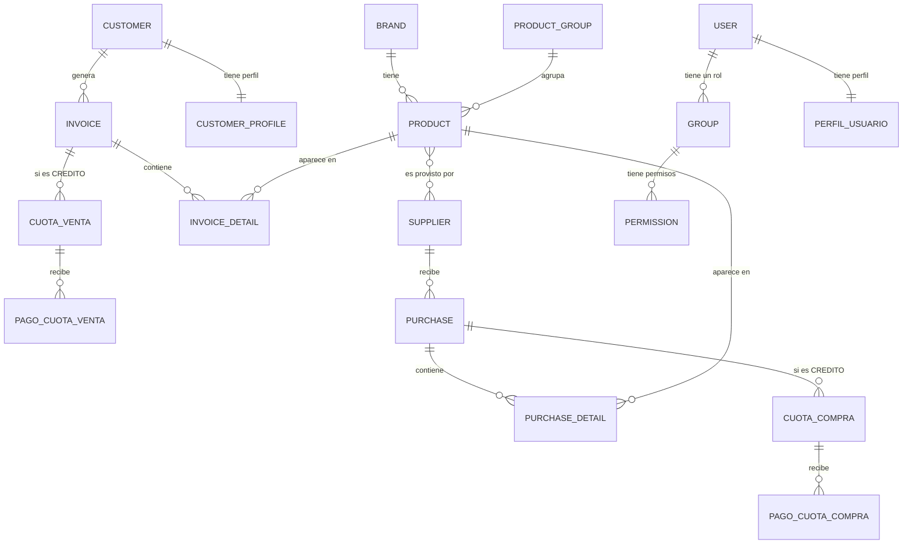

# 🧾 Sistema de Ventas, Compras y Créditos (Sales_A2)

Aplicación web desarrollada en **Django** para la gestión integral de un sistema de ventas y compras con crédito. Permite administrar marcas, grupos de productos, proveedores, productos, clientes, facturas y compras, con **IVA configurable**, **ventas y compras a crédito con cuotas mensuales**, **seguridad basada en roles y permisos granulares**, búsqueda avanzada, exportación a PDF/Excel, gestión de imágenes de productos y selección dinámica de columnas visibles en los listados.
a
> **Proyecto académico** — Ingeniería de Software, Universidad Estatal de Milagro (UNEMI)
>
> **Participantes:** Isaac Silva, Marcos Robinson  
> **Universidad:** UNEMI  
> **Fecha:** 22 de junio de 2026 (actualizado julio 2026)

---

instalacion correcta --

python -m venv ent_sales          # 1. crear venv fresco
ent_sales\Scripts\activate        # 2. activarlo
pip install -r requirements.txt   # 3. instalar dependencias
python manage.py migrate          # 4. aplicar migraciones
python manage.py createsuperuser  # 5. crear el primer usuario (Administrador)
python manage.py runserver        # 6. ¡correr!

## 📑 Tabla de contenidos

- [Apps del proyecto](#-apps-del-proyecto)
- [Características](#-características)
- [Tecnologías](#-tecnologías)
- [Estructura del proyecto](#-estructura-del-proyecto)
- [Modelo de datos](#-modelo-de-datos)
- [Requisitos previos](#-requisitos-previos)
- [Instalación y configuración](#-instalación-y-configuración)
- [Ejecución](#-ejecución)
- [Uso de la aplicación](#-uso-de-la-aplicación)
- [Decisiones de diseño](#-decisiones-de-diseño)
- [Notas y pendientes](#-notas-y-pendientes)
- [Guía de consultas ORM](#-guía-de-consultas-orm-referencia)
- [Autores](#-autores)

---

## 🧱 Apps del proyecto

| App               | Responsabilidad                                                                 |
|-------------------|----------------------------------------------------------------------------------|
| `billing`         | Catálogo (Marcas, Grupos, Proveedores, Productos, Clientes), Facturas, Configuración del sistema (IVA). |
| `purchasing`      | Compras a proveedores (cabecera + detalle), reporte de costos.                   |
| `security`        | Autenticación, Usuarios, Roles (Group) y matriz de Permisos granular por módulo. |
| `creditos_ventas` | Cuotas y pagos de **Facturas a crédito** (Fila 1 del caso de estudio).           |
| `creditos_compras`| Cuotas y pagos de **Compras a crédito**, mismo patrón que `creditos_ventas`.     |
| `shared`          | Utilidades compartidas entre apps: mixins, validadores, decoradores, envío de correos, middleware. No está en `INSTALLED_APPS` (no tiene modelos propios). |

---

## ✨ Características

- **CRUD completo** para Marcas, Grupos de productos, Proveedores, Productos, Clientes, Facturas y Compras.
- **Ventas y compras a crédito**: al facturar/comprar se elige `CONTADO` o `CRÉDITO`; si es crédito se generan cuotas mensuales automáticas que suman **exacto** el total (el redondeo se absorbe en la última cuota).
- **Pago de cuotas**: individual (con checkboxes de "saldo completo" / "fecha de hoy" para no escribir a mano) o **en lote** (selecciona varias cuotas con checkbox y paga todas de una vez; si cualquiera falla la validación, no se guarda nada del lote).
- **Consulta de cuotas pendientes** (global, sin entrar a una factura/compra puntual), con cuotas vencidas resaltadas en rojo.
- **Historial de pagos** por cuota o por factura/compra, con indicador visual de pago atrasado (comparando la fecha del pago contra el vencimiento de la cuota).
- **PDF de Plan de Pagos / Estado de Cuenta** (separado del PDF de la Factura/Compra), que refleja el estado de cuotas y pagos al momento de imprimirlo.
- **IVA configurable** desde una pantalla de Configuración del Sistema (`ConfiguracionSistema`), en vez de un porcentaje fijo en el código — se refleja tanto en el cálculo del backend como en el cálculo en vivo (JS) al armar una factura/compra.
- **Validación de stock**: el formset de detalle de factura rechaza la línea completa si se pide más cantidad que la disponible (mensaje claro con el producto y el faltante), revalidado con `select_for_update()` dentro de la transacción para blindar contra condiciones de carrera. El campo `stock` no permite valores negativos (validador + `clean_stock` en el formulario).
- **Autocompletado de precio/costo** al elegir un producto en una línea de factura/compra (fetch a un endpoint JSON), sin sobrescribir si el usuario ya editó el campo a mano.
- **Alta rápida de Cliente/Proveedor** desde un modal (AJAX) al armar una factura/compra, sin perder las líneas ya cargadas.
- **Seguridad basada en roles y permisos**: los usuarios se crean únicamente por el Administrador (con contraseña temporal enviada por correo y cambio obligatorio en el primer login); no hay auto-registro público. Cada rol (`Group`) tiene una matriz de permisos granular (ver/crear/editar/eliminar por módulo) editable desde `security:role_permissions`; el navbar y las vistas respetan esos permisos automáticamente, sin depender del nombre del rol.
- **Vistas detalladas** (DetailView) para todos los módulos con información completa de cada registro.
- **Cálculo automático** de subtotal, IVA y total al guardar una factura o compra, con resumen en vivo (JS) antes de guardar.
- **Búsqueda y filtros avanzados** en todos los listados (por nombre, estado, rango de precios/fechas, etc.).
- **Exportación de datos** a PDF y Excel desde cualquier listado respetando las columnas seleccionadas.
- **Selectores de columnas dinámicos** en todos los listados con persistencia en `localStorage`.
- **Gestión de imágenes** de productos con vista previa en los listados.
- **Interfaz responsiva** con Bootstrap 5 e iconos con Bootstrap Icons.
- **Panel de administración** de Django habilitado para todos los modelos, incluidas las cuotas y pagos.
- **Validación de datos** con validadores customizados (ej: cédula ecuatoriana en clientes).
- **Protección de integridad referencial** con `on_delete` `PROTECT`/`CASCADE` apropiados, y manejo amigable de `ProtectedError` al intentar borrar (mensaje claro en vez de pantalla de error técnica).

---

## 🛠 Tecnologías

| Componente        | Tecnología                             |
|-------------------|----------------------------------------|
| Lenguaje          | Python 3.13                            |
| Framework         | Django 6.0.6                           |
| Base de datos     | SQLite 3                               |
| Frontend          | Bootstrap 5.3 (vía CDN)                |
| Iconos            | Bootstrap Icons 1.11.3 (vía CDN)       |
| Estilos en forms  | django-widget-tweaks 1.5.1             |
| Exportación PDF   | ReportLab 4.2.5                        |
| Exportación Excel | openpyxl 3.1.5                         |
| Gestión imágenes  | Pillow 12.2.0                          |
| Utilidades dev    | django-extensions 4.1                  |
| Idioma / Zona     | Español (es-ec) / UTC                  |

---

## 📂 Estructura del proyecto

```
Sales_A2/
├── config/                     # Configuración del proyecto Django
│   ├── settings.py             # Ajustes (BD, apps, idioma, login, correo SMTP)
│   ├── urls.py                 # Rutas raíz (admin, accounts, security, purchases, creditos-ventas, creditos-compras, billing)
│   ├── asgi.py / wsgi.py       # Puntos de entrada del servidor
│   └── __init__.py
│
├── billing/                    # Catálogo, Facturas y Configuración del sistema
│   ├── migrations/
│   ├── templates/billing/      # Incluye base.html (navbar) usado por TODAS las apps
│   ├── models.py               # Brand, ProductGroup, Supplier, Product, Customer,
│   │                           #   CustomerProfile, Invoice, InvoiceDetail, ConfiguracionSistema
│   ├── views.py                # Vistas (FBV + CBV) con ExportMixin y PermissionRequiredMixin
│   ├── forms.py                # Formularios y formset de factura (con validación de stock) + SearchForms
│   ├── mixins.py                # ExportMixin (PDF/Excel con ReportLab/openpyxl)
│   ├── invoice_pdf.py           # PDF de la Factura (documento fijo)
│   ├── urls.py
│   └── admin.py
│
├── purchasing/                  # Compras a proveedores
│   ├── migrations/
│   ├── templates/purchasing/
│   ├── models.py                # Purchase (con tipo_pago/saldo/estado), PurchaseDetail
│   ├── views.py
│   ├── forms.py                 # PurchaseForm (tipo_pago/num_cuotas), PurchaseDetailFormSet
│   ├── purchase_pdf.py          # PDF de la Compra (documento fijo)
│   └── urls.py
│
├── security/                    # Autenticación, Usuarios, Roles y Permisos
│   ├── migrations/
│   ├── templates/security/
│   ├── models.py                # PerfilUsuario (must_change_password)
│   ├── views.py                 # Login/Logout, CRUD de Usuarios/Roles, matriz de Permisos
│   ├── forms.py                 # AdminUserCreateForm, UserUpdateForm, CambiarPasswordForm, GroupForm
│   ├── utils.py                 # Generación de username estilo universidad
│   ├── management/commands/setup_roles.py  # Crea los roles base con sus permisos
│   └── urls.py
│
├── creditos_ventas/              # Cuotas y pagos de Facturas a crédito
│   ├── migrations/
│   ├── templates/creditos_ventas/
│   ├── models.py                 # CuotaVenta, PagoCuotaVenta
│   ├── services.py               # generar_cuotas, recalcular_cuota, recalcular_factura
│   ├── views.py                  # Listados, pago individual/lote, historial, PDF Plan de Pagos
│   ├── forms.py                  # PagoCuotaVentaForm
│   ├── plan_pagos_pdf.py
│   └── urls.py
│
├── creditos_compras/              # Cuotas y pagos de Compras a crédito (mismo patrón)
│   ├── migrations/
│   ├── templates/creditos_compras/
│   ├── models.py                  # CuotaCompra, PagoCuotaCompra
│   ├── services.py                # generar_cuotas, recalcular_cuota, recalcular_compra
│   ├── views.py
│   ├── forms.py                   # PagoCuotaCompraForm
│   ├── plan_pagos_pdf.py
│   └── urls.py
│
├── shared/                       # Utilidades compartidas (sin modelos, no está en INSTALLED_APPS)
│   ├── validators.py             # Validadores customizados (cédula EC)
│   ├── mixins.py                 # StaffRequiredMixin, GroupRequiredMixin, PermissionRequiredMixin,
│   │                             #   ProtectedDeleteMixin
│   ├── decorators.py             # audit_action, permission_required_with_message
│   ├── emails.py                 # Envío de correos (bienvenida, factura en PDF)
│   └── middleware.py             # ForcePasswordChangeMiddleware
│
├── templates/registration/       # Login, cambio de contraseña
├── media/products/               # Imágenes subidas de productos
├── static/                       # Archivos estáticos (CSS/JS/imágenes)
├── dbsalesA2.sqlite3
├── manage.py
├── requirements.txt
└── README.md
```

---

## 🗃 Modelo de datos

### Diagrama entidad–relación (simplificado)



### Catálogo (`billing`)

**Brand / ProductGroup / Supplier / Product / Customer / CustomerProfile** — sin cambios de fondo respecto al catálogo original (marca, grupo, proveedor, producto con `stock` ahora validado con `MinValueValidator(0)`, cliente con validación de cédula/RUC ecuatoriana).

**ConfiguracionSistema** — singleton (`get_activa()`) con `iva_porcentaje` editable desde la UI, usado en el cálculo de facturas y compras (backend y JS en vivo).

### Facturación y Compras a crédito

**Invoice** (Factura)

| Campo        | Tipo                  | Notas                                         |
|--------------|-----------------------|-------------------------------------------------|
| customer     | ForeignKey → Customer | `PROTECT`                                      |
| invoice_date | DateTimeField         | Fecha automática al crear                       |
| subtotal / tax / total | DecimalField | Calculados al guardar, con el IVA configurable |
| tipo_pago    | CharField             | `CONTADO` / `CREDITO`                          |
| saldo        | DecimalField          | Saldo pendiente (0 si es contado)              |
| estado       | CharField             | `PENDIENTE` / `PAGADA`                         |

**Purchase** (Compra) — mismos campos `tipo_pago`/`saldo`/`estado` que `Invoice`, más `supplier`, `document_number`.

**CuotaVenta** / **CuotaCompra** — una cuota mensual de una factura/compra a crédito: `numero`, `fecha_vencimiento`, `valor`, `saldo`, `estado` (`PENDIENTE`/`PAGADA`). `UniqueConstraint(factura/compra, numero)` para que no existan cuotas duplicadas o mal numeradas.

**PagoCuotaVenta** / **PagoCuotaCompra** — un pago sobre una cuota: `fecha`, `valor`, `observacion`. `on_delete=PROTECT` en la cuota, así que una cuota con pagos no se puede eliminar sin antes borrar sus pagos.

> El saldo/estado de la cuota y de la factura/compra se recalculan **desde cero sumando todos los pagos vigentes** (no restando incrementalmente), para evitar drift numérico. Ver `services.py` de cada app (`generar_cuotas`, `recalcular_cuota`, `recalcular_factura`/`recalcular_compra`).

### Seguridad (`security`)

- **User / Group / Permission** — modelos nativos de Django (`django.contrib.auth`). Los usuarios se crean solo por el Administrador (`AdminUserCreateForm`, sin auto-registro público); cada usuario tiene **un único rol** (no múltiples grupos).
- **PerfilUsuario** — extiende `User` con `must_change_password`, que fuerza el cambio de contraseña en el primer login (`ForcePasswordChangeMiddleware`).
- La matriz de permisos (`security:role_permissions`) permite marcar ver/crear/editar/eliminar por módulo para cada rol; el navbar y las vistas (`PermissionRequiredMixin`, `permission_required_with_message`) leen esos permisos directamente — un rol nuevo ve automáticamente los links que le correspondan, sin tocar código.

---

## 📋 Requisitos previos

- **Python 3.13** (o compatible) instalado y disponible en el PATH.
- **pip** (incluido con Python).

```bash
python --version
pip --version
```

---

## ⚙️ Instalación y configuración

> Los comandos están pensados para **Windows (CMD/PowerShell)**. En Linux/Mac se activa el entorno con `source ent_sales/bin/activate`.

**1. Ubícate en la carpeta del proyecto**

```cmd
cd Sales_A2
```

**2. Crea un entorno virtual**

```cmd
python -m venv ent_sales
```

> El entorno virtual **no se comparte entre computadoras**. Si copiaste el proyecto de otra PC, bórralo y vuelve a crearlo con este comando.

**3. Activa el entorno virtual**

```cmd
ent_sales\Scripts\activate
```

**4. Instala las dependencias**

```cmd
pip install -r requirements.txt
```

**5. Aplica las migraciones**

```cmd
python manage.py migrate
```

**6. Crea un superusuario** (para entrar al admin y a la matriz de Roles/Permisos)

```cmd
python manage.py createsuperuser
```

**7. (Opcional) Crea los roles base con sus permisos**

```cmd
python manage.py setup_roles
```

> Desde ahí, el resto de usuarios se crean **solo desde la app** (Seguridad → Usuarios → Nuevo), no por auto-registro: el sistema genera una contraseña temporal y la envía por correo (o la muestra en pantalla si el correo no está configurado), y obliga a cambiarla en el primer login.

---

## ▶️ Ejecución

Con el entorno virtual activado:

```cmd
python manage.py runserver
```

Luego abre en el navegador:

| Recurso                         | URL                                    |
|----------------------------------|-----------------------------------------|
| Aplicación (Home)                | http://127.0.0.1:8000/                  |
| Panel de administración          | http://127.0.0.1:8000/admin/            |
| Inicio de sesión                | http://127.0.0.1:8000/security/login/   |
| Facturas                        | http://127.0.0.1:8000/invoices/         |
| Compras                         | http://127.0.0.1:8000/purchases/        |
| Cuotas pendientes (Ventas)       | http://127.0.0.1:8000/creditos-ventas/pendientes/ |
| Cuotas pendientes (Compras)      | http://127.0.0.1:8000/creditos-compras/pendientes/ |
| Usuarios / Roles / Permisos      | http://127.0.0.1:8000/security/users/ · `/security/roles/` · `/security/permissions/` |
| Configuración del sistema (IVA)  | http://127.0.0.1:8000/configuracion/    |

---

## 🧭 Uso de la aplicación

### Flujo general

1. **Inicia sesión** (no hay registro público; el Administrador crea las cuentas). Sin sesión activa, todas las pantallas redirigen al login.
2. **Carga los catálogos base**: Marcas → Grupos → Proveedores → Productos → Clientes (un producto necesita marca y grupo; una factura necesita cliente y productos).
3. **Crea una factura o compra:**
   - Elige `CONTADO` o `CRÉDITO`. Si es crédito, indica el número de cuotas mensuales.
   - Agrega líneas de detalle (producto, cantidad, precio/costo) con **+ Agregar producto**; el precio se autocompleta al elegir el producto y el subtotal/IVA/total se calculan en vivo.
   - Si pides más cantidad de la que hay en stock, la línea se rechaza con un mensaje claro (solo en Facturas).
   - Al guardar: si es CONTADO, queda `PAGADA` de inmediato; si es CRÉDITO, se generan las cuotas mensuales y queda `PENDIENTE`.
4. **Gestiona las cuotas a crédito** desde "Ver Cuotas" (en el detalle de la factura/compra) o desde "Cuotas Pendientes" (vista global, sin entrar a un documento puntual): paga una cuota individual o varias en lote, revisa el historial de pagos (con aviso si algún pago fue atrasado), e imprime el PDF del Plan de Pagos en cualquier momento.

### Características en los listados

En **todos los listados**: búsqueda/filtros, selector de columnas con persistencia en `localStorage`, exportación a PDF/Excel respetando las columnas activas, ver/editar/eliminar con permisos (los botones se ocultan según el permiso del usuario), paginación con conservación de filtros.

### Rutas principales

| Módulo          | Listado                     | Crear                          | Detalle / Cuotas                  |
|-----------------|------------------------------|----------------------------------|-------------------------------------|
| Marcas          | `/brands/`                  | `/brands/create/`                | `/brands/<id>/`                    |
| Grupos          | `/groups/`                  | `/groups/create/`                | `/groups/<id>/`                    |
| Proveedores     | `/suppliers/`                | `/suppliers/create/`             | `/suppliers/<id>/`                 |
| Productos       | `/products/`                 | `/products/create/`              | `/products/<id>/`                  |
| Clientes        | `/customers/`                | `/customers/create/`             | `/customers/<id>/`                 |
| Facturas        | `/invoices/`                  | `/invoices/create/`              | `/invoices/<id>/` · `/invoices/<id>/pdf/` |
| Compras         | `/purchases/`                 | `/purchases/create/`             | `/purchases/<id>/` · `/purchases/<id>/pdf/` |
| Cuotas (Ventas) | `/creditos-ventas/pendientes/` | —                               | `/creditos-ventas/factura/<id>/cuotas/` |
| Cuotas (Compras)| `/creditos-compras/pendientes/`| —                               | `/creditos-compras/compra/<id>/cuotas/` |
| Usuarios        | `/security/users/`            | `/security/users/create/`        | —                                   |
| Roles/Permisos  | `/security/roles/`            | `/security/roles/create/`        | `/security/roles/<id>/permisos/`   |

---

## 🧩 Decisiones de diseño

### Vistas basadas en funciones (FBV) vs. en clases (CBV)

Se combinan ambos enfoques a propósito:

- **FBV** (`invoice_create`, `purchase_create`, `invoice_detail`, `registrar_pago`, `pagar_cuotas_lote`): donde conviene controlar manualmente el flujo `GET`/`POST`, coordinar dos formularios a la vez (cabecera + formset de detalle) o encadenar varios pasos de validación/negocio dentro de una transacción.
- **CBV** (catálogo, cuotas, historial, permisos): usan las vistas genéricas de Django (`ListView`, `DetailView`, `CreateView`, `UpdateView`, `DeleteView`) para reducir el código repetitivo de un CRUD estándar.

### Seguridad y permisos, no nombres de rol hardcodeados

El navbar y las vistas de negocio (Facturas, Compras, catálogo) verifican `perms.<app>.<accion>_<modelo>`, **no** el nombre del grupo. Esto significa que un rol nuevo, con los permisos que le marques en la matriz, ve automáticamente lo que le corresponde sin tocar plantillas ni código. La única excepción intencional es el módulo "Seguridad" del navbar, reservado exclusivamente al rol llamado `Administrador`.

Los mixins reutilizables (`shared/mixins.py`) — `StaffRequiredMixin`, `GroupRequiredMixin`, `PermissionRequiredMixin`, `ProtectedDeleteMixin` — y el decorador `permission_required_with_message` siguen todos el mismo patrón: si falta el permiso, redirigen con un mensaje de error amigable (no un 403 crudo de Django).

### Ventas/Compras a crédito: patrón de `services.py`

`creditos_ventas` y `creditos_compras` centralizan la lógica de negocio de cuotas en un módulo `services.py` (no en las vistas ni en los modelos):

- `generar_cuotas(documento, num_cuotas)`: reparte el total en cuotas mensuales iguales, absorbiendo el redondeo en la última para que la suma sea **exacta**.
- `recalcular_cuota(cuota)` / `recalcular_factura(...)` / `recalcular_compra(...)`: recalculan el saldo **desde cero sumando todos los pagos vigentes** (no restando incrementalmente), para no arrastrar errores de redondeo ni desincronizarse si se borra un pago.

El pago en lote (`pagar_cuotas_lote`) valida cada cuota seleccionada dentro de una única `transaction.atomic()`: si cualquiera falla, no se guarda nada del lote.

### Validación de stock con blindaje contra condición de carrera

`invoice_create` valida el stock en dos capas:

1. **Formset** (`BaseInvoiceDetailFormSet.clean()`): rechaza la factura completa si alguna línea pide más cantidad de la disponible, indicando qué producto y cuánto falta.
2. **Vista**, dentro de la misma transacción: revalida con `Product.objects.select_for_update().get(...)` justo antes de descontar, cerrando la ventana entre "se validó" y "se descontó" ante dos facturas simultáneas sobre el mismo producto.

### IVA configurable, no hardcodeado

`ConfiguracionSistema.get_activa().iva_porcentaje` reemplaza el `0.15` fijo, tanto en el cálculo del backend (`invoice_create`/`purchase_create`) como en el cálculo en vivo (JS) de los formularios — pasado al template con el filtro `unlocalize` para evitar que el locale `es-ec` (coma decimal) rompa el número en JavaScript.

### Selectores de columnas dinámicos con localStorage

Cada listado define un diccionario `*_ALL_COLUMNS` con metadatos (`key`, `label`, `default`, `export`). JavaScript con `localStorage` permite alternar columnas de forma persistente; al exportar, solo se incluyen las columnas activas.

### ExportMixin para PDF y Excel

ReportLab genera los PDF de listados (tabla, encabezados coloreados, orientación dinámica según número de columnas); openpyxl formatea el Excel. Los documentos de **un solo registro** (Factura, Compra, Plan de Pagos) usan generadores propios (`invoice_pdf.py`, `purchase_pdf.py`, `plan_pagos_pdf.py`) con el mismo estilo visual, separados del `ExportMixin` de listados.

### Integridad referencial (`on_delete`) con mensajes amigables

`PROTECT` en `Product.brand/group`, `Invoice.customer`, `InvoiceDetail.product`, `CuotaVenta.factura`, `PagoCuotaVenta.cuota` (y sus equivalentes de Compras) impide borrar un registro en uso. `ProtectedDeleteMixin` (CBV) y un `try/except ProtectedError` (vistas de función como `purchase_delete`) capturan ese error y muestran un mensaje claro en vez de la pantalla técnica de Django.

### Bootstrap e iconos en templates (no en `forms.py`)

Las clases de Bootstrap se aplican en la **plantilla** (via `django-widget-tweaks` o directamente en los widgets), manteniendo `forms.py` centrado en validación. Los iconos usan **Bootstrap Icons** vía CDN.

---

## 📝 Notas y pendientes

### Observaciones técnicas

- **`requirements.txt`** incluye paquetes que no pertenecen a este proyecto (Flask, Jinja2, Werkzeug, etc.), arrastrados de otro entorno. Las dependencias realmente necesarias son: `Django`, `asgiref`, `sqlparse`, `tzdata`, `django-widget-tweaks`, `openpyxl`, `reportlab`, `pillow`, `django-extensions`.
- **Correo saliente**: `config/settings.py` usa el backend SMTP de Gmail. Sin credenciales reales configuradas, cambia `EMAIL_BACKEND` al backend de consola para desarrollo (ver comentario en el propio archivo).
- **Directorio `media/`**: debe existir para imágenes de productos; Django lo crea automáticamente, pero en producción debe servirse aparte del servidor de aplicación.
- **Validador de cédula**: `shared/validators.py` verifica la cédula/RUC ecuatoriana según el algoritmo oficial.
- **Migraciones de datos**: agregar un validador (`MinValueValidator`) a un campo existente no corrige los datos que ya estén fuera de rango (ej. productos con stock negativo de antes del fix) — hay que corregirlos a mano.

### Posibles mejoras futuras

- Aplicar el mismo blindaje de `select_for_update()` (condición de carrera) al descuento/aumento de stock en Compras, igual que ya se hizo en Facturas.
- Reportes agregados (ventas por período, top productos, cartera vencida total).
- Dashboard con gráficos.
- API REST para integración con terceros.
- Auditoría más completa (quién editó/borró qué y cuándo, más allá del log de `audit_action`).
- Notificación por correo cuando una cuota está por vencer o ya venció.
- Extender el pago en lote y el resaltado de "vencida"/"pago atrasado" a un posible módulo de cobros si se agrega en el futuro.

---

## 🔎 Guía de consultas ORM (referencia)

Referencia rápida de las consultas con el ORM de Django aplicadas a este sistema. Cada enunciado va acompañado de su sentencia correcta. Útil para pruebas en el shell (`python manage.py shell`).

> Imports necesarios al inicio de la sesión:
> ```python
> from django.db.models import Q, F, Sum, Avg, Max, Min, Count
> ```

### CREATE y READ

Una clase = una tabla, un objeto = una fila, `.objects` = la puerta de entrada. `.create()` guarda sin necesidad de `.save()`. `.get()` devuelve **un objeto** (lanza error si encuentra cero o varios); `.filter()` devuelve un **QuerySet**.

| Enunciado | Sentencia |
|-----------|-----------|
| Crear una marca `'Sony'` (sin descripción) en una variable. | `sony = Brand.objects.create(name='Sony')` |
| Traer todos los productos. | `Product.objects.all()` |
| Traer el único cliente con dni `'0912345678'`. | `Customer.objects.get(dni='0912345678')` |
| Traer los productos con stock distinto de cero. | `Product.objects.exclude(stock=0)` |
| Contar cuántas marcas hay. | `Brand.objects.count()` |
| Crear un grupo `'Perifericos'` en una variable. | `perifericos = ProductGroup.objects.create(name='Perifericos')` |
| Traer todas las marcas. | `Brand.objects.all()` |
| Productos con precio mayor a 800. | `Product.objects.filter(unit_price__gt=800)` |
| Productos cuyo nombre contenga `'tab'` (sin importar mayúsculas). | `Product.objects.filter(name__icontains='tab')` |
| ¿Existe algún producto con stock cero? (True/False) | `Product.objects.filter(stock=0).exists()` |

**Lookups:** `__gt` (mayor que) · `__lt` (menor que) · `__range=(a, b)` (entre, incluidos) · `__icontains` (contiene, ignora mayúsculas).
**Otros:** `exclude` (lo contrario de filter) · `order_by('-campo')` (`-` = descendente) · `count()` · `exists()`.

### UPDATE y DELETE

Un objeto → `get` + cambiar atributo + **`.save()` obligatorio**. Muchos → `filter().update()` (devuelve cuántas filas cambió; no lanza error si no coincide nada).

| Enunciado | Sentencia |
|-----------|-----------|
| Traer `'Sony'`, cambiar descripción a `'Japanese electronics'` y guardar. | `s = Brand.objects.get(name='Sony'); s.description = 'Japanese electronics'; s.save()` |
| Masivo: `is_active=False` a productos con stock cero. | `Product.objects.filter(stock=0).update(is_active=False)` |
| Borrar la marca `'Sony'`. | `Brand.objects.get(name='Sony').delete()` |
| Masivo: `is_active=True` a productos con stock mayor a 0. | `Product.objects.filter(stock__gt=0).update(is_active=True)` |
| Borrar el grupo `'Perifericos'`. | `ProductGroup.objects.get(name='Perifericos').delete()` |

**Comportamiento `on_delete`:** `CASCADE` borra en cascada · `PROTECT` bloquea con `ProtectedError` · `SET_NULL` deja el campo en `NULL`.

### Relaciones (FK, M2M, OneToOne)

`.` (punto) cuando ya tienes el objeto · `__` (doble guion) cuando filtras. Lado "uno" → un objeto; lado "muchos" → un QuerySet.

| Enunciado | Sentencia |
|-----------|-----------|
| FK adelante: nombre de la marca del `'Galaxy S24'`. | `galaxy = Product.objects.get(name='Galaxy S24'); galaxy.brand.name` |
| FK atrás: productos de la marca `'Samsung'`. | `samsung = Brand.objects.get(name='Samsung'); samsung.products.all()` |
| FK atrás: contar los productos de `'Samsung'`. | `samsung.products.count()` |
| M2M: agregar un proveedor al `'Galaxy S24'`. | `techdist = Supplier.objects.get(name='TechDist'); galaxy.suppliers.add(techdist)` |
| M2M: mostrar los proveedores del `'Galaxy S24'`. | `galaxy.suppliers.all()` |
| M2M: quitar un proveedor del `'Galaxy S24'`. | `galaxy.suppliers.remove(techdist)` |
| OneToOne: `credit_limit` del perfil del cliente `'0912345678'`. | `client = Customer.objects.get(dni='0912345678'); client.profile.credit_limit` |
| OneToOne: `taxpayer_type` del perfil de ese cliente. | `client.profile.taxpayer_type` |

**Métodos ManyToMany:**

| Método | Tenía [A, B], ejecuto… | Queda con |
|--------|------------------------|-----------|
| `add(C)` | suma sin borrar | [A, B, C] |
| `remove(B)` | quita ese vínculo | [A] |
| `clear()` | quita todos los vínculos | [] |
| `set([C])` | reemplaza por la lista | [C] |

> `remove()` y `clear()` **desvinculan**, no borran el `Supplier` de la base de datos. `.delete()` sí lo elimina.

**Filtrar cruzando relaciones:**
```python
Product.objects.filter(brand__name='Samsung')          # FK
Product.objects.filter(suppliers__name='TechDist')     # M2M
Customer.objects.filter(profile__taxpayer_type='ruc')  # OneToOne
```

### Q() y F()

`Q()` permite el **OR** (operador `|`), que no se puede expresar de otra forma. `F()` opera con el valor actual de una columna directamente en la base de datos.

| Enunciado | Sentencia |
|-----------|-----------|
| Productos de marca `'Samsung'` **O** con stock mayor a 100. | `Product.objects.filter(Q(brand__name='Samsung') | Q(stock__gt=100))` |
| Productos con precio menor a 50 **O** mayor a 1000. | `Product.objects.filter(Q(unit_price__lt=50) | Q(unit_price__gt=1000))` |
| Subir el stock de todos los productos en 10 (en la BD). | `Product.objects.update(stock=F('stock') + 10)` |
| Subir el precio de todos los productos un 10% (en la BD). | `Product.objects.update(unit_price=F('unit_price') * 1.10)` |

**Operadores de `Q()`:** `|` (OR) · `&` (AND) · `~` (NOT).

> Comas en `filter` = AND (todas las condiciones); `|` con `Q()` = OR (basta una). Tras un `update()` con `F()`, la variable en memoria queda desactualizada: recargar con `objeto.refresh_from_db()`.

### Agregaciones (aggregate vs annotate)

`aggregate()` devuelve **un número resumen de todo** (un diccionario). `annotate()` devuelve **un número por cada grupo** (un QuerySet).

| Enunciado | Sentencia |
|-----------|-----------|
| Precio promedio de todos los productos. | `Product.objects.aggregate(avg=Avg('unit_price'))` |
| Precio máximo y mínimo en una sola consulta. | `Product.objects.aggregate(max=Max('unit_price'), min=Min('unit_price'))` |
| Suma del `total` de las facturas del cliente `'0912345678'`. | `Invoice.objects.filter(customer__dni='0912345678').aggregate(total=Sum('total'))` |
| Por cada marca: nombre y cuántos productos tiene. | `Brand.objects.annotate(n=Count('products')).values('name', 'n')` |
| Por cada producto: nombre y cuántos proveedores tiene. | `Product.objects.annotate(ns=Count('suppliers')).values('name', 'ns')` |

> Regla práctica: "de todos / en total / promedio general" → `aggregate`; "por cada / agrupado por" → `annotate`.

### Errores comunes

| Error | Causa | Solución |
|-------|-------|----------|
| `NameError` | Variable no creada. | Traer el objeto a una variable con `get()` primero. |
| `IntegrityError: UNIQUE` | Crear algo que ya existe. | Si ya existe, traerlo con `get`, no con `create`. |
| `AttributeError` (related manager) | Pedir a un objeto un manager del otro lado. | Verificar de qué lado de la relación se parte. |
| `DoesNotExist` | Un `get()` no encontró nada. | Verificar el nombre exacto con `values_list`. |
| `MultipleObjectsReturned` | Un `get()` encontró varios. | Usar `filter`, o un campo único (dni). |
| Update devuelve `0` | El `filter` no coincidió con nada. | Revisar el valor exacto del filtro. |

**Inspección útil en el shell:**
```python
Brand.objects.values_list('name', flat=True)  # nombres exactos de una tabla
objeto.refresh_from_db()                       # recargar un objeto desde la BD
```

### Ejemplos prácticos con salida real (input / output)

**F() — operar con el valor de una columna en la base de datos**
```python
>>> Product.objects.update(stock=F('stock') + 15)
4                          # nº de filas modificadas
>>> Product.objects.update(unit_price=F('unit_price') * 0.90)
4                          # baja el precio 10% a todos, en la BD
```
`F()` deja la variable en memoria desactualizada. Hay que recargarla:
```python
>>> galaxy.stock
1010                       # valor VIEJO (en memoria)
>>> galaxy.refresh_from_db()
>>> galaxy.stock           # ahora sí, el valor actualizado desde la BD
```

**Q() — consultas con OR (operador `|`)**
```python
>>> Product.objects.filter(Q(brand__name='Samsung') | Q(unit_price__gt=1200))
<QuerySet [<Product: Galaxy S24 (Samsung)>]>
```

**aggregate() — un número resumen de todo (devuelve diccionario)**
```python
>>> Product.objects.aggregate(prom=Avg('unit_price'))
{'prom': Decimal('503.189799750000')}
>>> Product.objects.aggregate(max=Max('unit_price'), min=Min('unit_price'))
{'max': Decimal('980.09...'), 'min': Decimal('52.56...')}
>>> Product.objects.aggregate(total=Sum('stock'))
{'total': 1204}
>>> Invoice.objects.filter(customer__dni='0912345678').aggregate(total=Sum('total'))
{'total': Decimal('4825.29000000000')}
```

**annotate() — un número por cada grupo (devuelve QuerySet)**
```python
>>> Brand.objects.annotate(n=Count('products')).values('name', 'n')
<QuerySet [{'name': 'Samsung', 'n': 1}, {'name': 'Inca Cola', 'n': 0},
           {'name': 'HP', 'n': 1}, {'name': 'Logitech', 'n': 1}]>
# incluye marcas con 0 productos porque internamente usa LEFT OUTER JOIN
```

### Ejercicios avanzados resueltos

**1. Productos que NO sean de marca "Apple" (usando `~Q`)**
```python
Product.objects.filter(~Q(brand__name='Apple'))   # ~ niega la condición
```

**2. Por cada proveedor, el precio promedio de sus productos**
```python
>>> Supplier.objects.annotate(promedio=Avg('products__unit_price')).values('name', 'promedio')
<QuerySet [{'name': 'TechnoThing', 'promedio': Decimal('980.09...')},
           {'name': 'Imperio', 'promedio': Decimal('980.09...')}]>
```

**3. Marcas cuyo stock total sea mayor a 80**
```python
>>> Brand.objects.annotate(total=Sum('products__stock')).filter(total__gt=80).values('name', 'total')
<QuerySet [{'name': 'Samsung', 'total': 1025}, {'name': 'RedDragon', 'total': 125}]>
# filtrar sobre el campo calculado 'total' genera un HAVING en SQL
```

**4. El producto más caro, objeto completo (con `order_by`, no `aggregate`)**
```python
Product.objects.order_by('-unit_price').first()
```

**5. Borrar las marcas que no tengan descripción**
```python
Brand.objects.filter(description__isnull=True).delete()
# NULL ≠ ''. Para ambos: filter(Q(description__isnull=True) | Q(description=''))
```

**6. Productos que cuesten menos de 100 O tengan stock mayor a 50**
```python
Product.objects.filter(Q(unit_price__lt=100) | Q(stock__gt=50))
```

**7. Por cada marca, cuántos productos tiene**
```python
Brand.objects.annotate(n=Count('products')).values('name', 'n')
```

**8. Marcas que tengan más de 2 productos**
```python
Brand.objects.annotate(cantidad=Count('products')).filter(cantidad__gt=2).values('name', 'cantidad')
# Count('products') cuenta productos; NO confundir con Sum('products__stock')
```

**9. El proveedor con más compras**
```python
Supplier.objects.annotate(num=Count('purchases')).order_by('-num').first()
# 'purchases' depende del related_name de la FK en el modelo Purchase
```

**10. Subir el precio de todos los productos un 10%**
```python
Product.objects.update(unit_price=F('unit_price') * 1.10)
```

### Cálculo de porcentajes

| Se pide… | Multiplicar por | Razón |
|----------|-----------------|-------|
| El 10% de un valor (solo la parte) | `0.10` | es el pedazo |
| Subir un 10% (nuevo total) | `1.10` | 100% + 10% |
| Bajar un 10% (nuevo total) | `0.90` | 100% − 10% |
| Subir un 25% | `1.25` | 100% + 25% |
| Bajar un 30% | `0.70` | 100% − 30% |

Regla general: **subir X%** → `1 + (X/100)`; **bajar X%** → `1 − (X/100)`. Ej: 200 × 1.10 = 220.

### Optimización: select_related vs prefetch_related

Ambos resuelven el problema **N+1** (una consulta extra por cada objeto relacionado). Se diferencian por el tipo de relación:

| | `select_related` | `prefetch_related` |
|---|------------------|--------------------|
| Relaciones | **FK** y **OneToOne** (lado "uno") | **M2M** y **FK inversa** (lado "muchos") |
| Cómo | Un **JOIN** (una sola consulta) | Consultas **separadas** unidas en Python |

```python
# select_related → FK / OneToOne (lado "uno")
Product.objects.select_related('brand')            # producto → su marca (FK)
Product.objects.select_related('brand', 'group')   # varias FK a la vez
Customer.objects.select_related('profile')         # cliente → su perfil (OneToOne)

# prefetch_related → M2M / FK inversa (lado "muchos")
Product.objects.prefetch_related('suppliers')      # producto → sus proveedores (M2M)
Brand.objects.prefetch_related('products')         # marca → sus productos (FK inversa)
Supplier.objects.prefetch_related('products')      # proveedor → sus productos (M2M)
```

Mnemónica: **select** = un JOIN (uno solo) → FK/OneToOne · **prefetch** = pre-buscar aparte (muchos) → M2M/inversa.

### El orden de values() y annotate() importa

Según dónde se ponga `values()`, cambia el resultado:

| Posición | Qué hace |
|----------|----------|
| `values()` **antes** de `annotate()` | Define el **GROUP BY** (agrupa por ese campo) |
| `values()` **después** de `annotate()` | Solo elige **qué columnas mostrar** (cosmético) |

```python
# values ANTES → agrupa POR ese campo (define el GROUP BY)
Product.objects.values('brand__name').annotate(total=Count('id'))
# [{'brand__name': 'Samsung', 'total': 1}, {'brand__name': 'HP', 'total': 1}, ...]
# "cuántos productos hay por cada marca", partiendo desde Product

Product.objects.values('group__name').annotate(total=Count('id'))
# "cuántos productos hay por cada grupo"

# values DESPUÉS → solo elige columnas a mostrar
Brand.objects.annotate(n=Count('products')).values('name', 'n')
# aquí el values del final solo maquilla qué campos se ven
```

Regla: si se pide "cuántos X **por cada** Y" empezando desde X, el patrón es `X.objects.values('Y').annotate(...)`.

### Dudas frecuentes resueltas

**`.create()` vs instanciar + `.save()`** — `create()` instancia y guarda en un paso; `Modelo(...)` solo crea en memoria hasta el `.save()`.

**`.save()` decide INSERT o UPDATE** — `INSERT` si el objeto es nuevo (sin `id`), `UPDATE` si ya existe.

**Q() va en `filter`, F() va en `update`** — *Q pregunta (filtra), F transforma (actualiza)*.

**annotate crea un campo temporal** — `annotate(total=...)` inventa el campo `total`, usable en `filter`/`order_by` después. El annotate va ANTES. Filtrar sobre él genera un `HAVING`.

**`Count` vs `Sum`** — `Count` cuenta filas ("cuántos"); `Sum` suma valores de una columna ("cuánto en total"). `Sum` de un grupo vacío devuelve `None`, no `0`.

**Objeto completo vs valor** — máximo como número → `aggregate(Max(...))`; objeto completo más caro → `order_by('-campo').first()`.

**Filtrar nulos** — `filter(campo__isnull=True)` (NULL) / `=False` (con valor). NULL ≠ `''`.

**Borrar no elimina la variable** — tras `delete()`, la variable sigue en memoria; un `.save()` posterior recrea la fila con un `INSERT`.

**Antes de un DELETE masivo** — correr el `filter` sin `.delete()` y un `.count()` para ver qué caería. Según el `on_delete`, puede lanzar `ProtectedError`.

**El error como guía** — `FieldError: Cannot resolve keyword 'nombre'` lista los campos válidos en `Choices are: ...`.

---

## 👨‍💻 Autores

Proyecto desarrollado por **Isaac Silva** y **Marcos Robinson** — Ingeniería de Software, UNEMI (2026).
