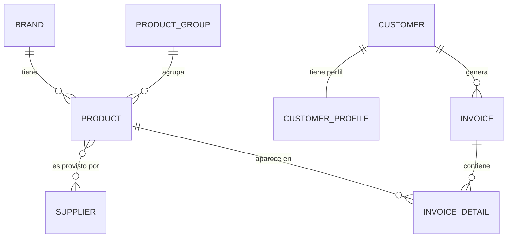

# 🧾 Sistema de Ventas y Facturación (Sales_A2)

Aplicación web desarrollada en **Django** para la gestión integral de un sistema de ventas y facturación. Permite administrar marcas, grupos de productos, proveedores, productos, clientes e invoices, con cálculo automático de impuestos (IVA al 15%), búsqueda avanzada, exportación a PDF/Excel, gestión de imágenes de productos y selección dinámica de columnas visibles en los listados.

> **Proyecto académico** — Ingeniería de Software, Universidad Estatal de Milagro (UNEMI)
>
> **Participantes:** Isaac Silva, Marcos Robinson  
> **Universidad:** UNEMI  
> **Fecha:** 22 de junio de 2026

---

intalacion correcta --

python -m venv ent_sales_A2          # 1. crear venv fresco
ent_sales_A2\Scripts\activate        # 2. activarlo
pip install -r requirements.txt      # 3. instalar dependencias
python manage.py runserver           # 4. ¡correr! (sin migrate, sin createsuperuser)

## 📑 Tabla de contenidos

- [Características](#-características)
- [Tecnologías](#-tecnologías)
- [Estructura del proyecto](#-estructura-del-proyecto)
- [Modelo de datos](#-modelo-de-datos)
- [Requisitos previos](#-requisitos-previos)
- [Instalación y configuración](#-instalación-y-configuración)
- [Ejecución](#-ejecución)
- [Uso de la aplicación](#-uso-de-la-aplicación)
- [Decisiones de diseño](#-decisiones-de-diseño)
- [Notas y pendientes](#-notas-y-pendientes)
- [Autores](#-autores)

---

## ✨ Características

- **CRUD completo** para 6 módulos: Marcas, Grupos de productos, Proveedores, Productos, Clientes y Facturas.
- **Vistas detalladas** (DetailView) para todos los módulos con información completa de cada registro.
- **Sistema de facturación** con líneas de detalle dinámicas (agregar/quitar productos en la misma pantalla).
- **Cálculo automático** de subtotal, IVA (15%) y total al guardar una factura.
- **Autenticación de usuarios**: registro (signup), inicio y cierre de sesión.
- **Acceso protegido**: todas las pantallas requieren sesión iniciada (LoginRequiredMixin).
- **Búsqueda y filtros avanzados** en todos los listados (por nombre, estado, rango de precios/fechas, etc.).
- **Exportación de datos** a PDF y Excel desde cualquier listado respetando las columnas seleccionadas.
- **Selectores de columnas dinámicos** en todos los listados con persistencia en localStorage.
- **Gestión de imágenes** de productos con vista previa en los listados.
- **Interfaz responsiva** con Bootstrap 5 e iconos con Bootstrap Icons.
- **Panel de administración** de Django habilitado para todos los modelos.
- **Validación de datos** con validadores customizados (ej: cédula ecuatoriana en clientes).
- **Protección de integridad referencial** con ON_DELETE PROTECT/CASCADE apropiados.

---

## 🛠 Tecnologías

| Componente        | Tecnología                             |
|-------------------|----------------------------------------|
| Lenguaje          | Python 3.13                            |
| Framework         | Django 6.0.6                           |
| Base de datos     | SQLite 3                               |
| Frontend          | Bootstrap 5.3 (vía CDN)                |
| Iconos            | Bootstrap Icons 1.11.3 (vía CDN)       |
| Estilos en forms  | django-widget-tweaks 1.5.1             |
| Exportación PDF   | ReportLab 4.2.5                        |
| Exportación Excel | openpyxl 3.1.5                         |
| Gestión imágenes  | Pillow 12.2.0                          |
| Idioma / Zona     | Español (es-ec) / UTC                  |

---

## 📂 Estructura del proyecto

```
Sales_A2/
├── config/                     # Configuración del proyecto Django
│   ├── settings.py             # Ajustes (BD, apps, idioma, login)
│   ├── urls.py                 # Rutas raíz (admin, accounts, billing)
│   ├── asgi.py / wsgi.py       # Puntos de entrada del servidor
│   └── __init__.py
│
├── billing/                    # App principal (lógica de negocio)
│   ├── migrations/             # Migraciones de la base de datos
│   ├── templates/billing/      # Plantillas HTML del módulo
│   │   ├── base.html           # Plantilla base (navbar, footer, mensajes)
│   │   ├── *_list.html         # Listados con selectores de columnas dinámicos
│   │   ├── *_detail.html       # Vistas detalladas de cada entidad
│   │   ├── *_form.html         # Formularios de crear/editar
│   │   └── *_confirm_delete.html  # Confirmaciones de borrado
│   ├── models.py               # Modelos (8 entidades)
│   ├── views.py                # Vistas (FBV + CBV) con ExportMixin
│   ├── forms.py                # Formularios y formset de factura + SearchForms
│   ├── mixins.py               # ExportMixin (PDF/Excel con ReportLab/openpyxl)
│   ├── urls.py                 # Rutas de la app billing
│   └── admin.py                # Registro de modelos en el admin
│
├── shared/                     # Utilidades compartidas
│   ├── validators.py           # Validadores customizados (cédula EC)
│   ├── mixins.py               # Mixins reutilizables
│   └── decorators.py           # Decoradores personalizados
│
├── templates/
│   └── registration/           # Plantillas de autenticación
│       ├── login.html
│       └── signup.html
│
├── media/
│   └── products/               # Imágenes subidas de productos
│
├── static/                     # Archivos estáticos (CSS/JS/imágenes)
├── dbsalesA2.sqlite3           # Base de datos SQLite
├── manage.py                   # Utilidad de gestión de Django
├── requirements.txt            # Dependencias del proyecto
└── README.md                   # Este archivo
```

---

## 🗃 Modelo de datos

El sistema se compone de **8 entidades** relacionadas entre sí.

### Diagrama entidad–relación



### Descripción de las entidades

**Brand** (Marca) — Marcas de los productos.

| Campo        | Tipo          | Notas                  |
|--------------|---------------|------------------------|
| name         | CharField     | Único, obligatorio     |
| description  | TextField     | Opcional               |
| is_active    | BooleanField  | Por defecto `True`     |
| created_at   | DateTimeField | Automático al crear    |
| updated_at   | DateTimeField | Automático al editar   |

**ProductGroup** (Grupo de productos) — Categorías de productos.

| Campo      | Tipo         | Notas              |
|------------|--------------|--------------------|
| name       | CharField    | Único, obligatorio |
| is_active  | BooleanField | Por defecto `True` |

**Supplier** (Proveedor) — Empresas que abastecen productos.

| Campo         | Tipo        | Notas                          |
|---------------|-------------|--------------------------------|
| name          | CharField   | Nombre de la compañía          |
| contact_name  | CharField   | Persona de contacto (opcional) |
| email         | EmailField  | Opcional                       |
| phone         | CharField   | Opcional                       |
| address       | TextField   | Opcional                       |
| is_active     | BooleanField| Por defecto `True`             |

**Product** (Producto) — Artículos a la venta.

| Campo       | Tipo                | Notas                                  |
|-------------|---------------------|----------------------------------------|
| name        | CharField           | Obligatorio                            |
| description | TextField           | Opcional                               |
| brand       | ForeignKey → Brand  | `PROTECT` (no borra si está en uso)    |
| group       | ForeignKey → Group  | `PROTECT`                              |
| suppliers   | ManyToMany → Supplier | Varios proveedores por producto      |
| unit_price  | DecimalField        | Precio unitario                        |
| stock       | IntegerField        | Existencias, por defecto `0`           |
| image       | ImageField          | Imagen del producto, opcional          |
| is_active   | BooleanField        | Por defecto `True`                     |
| created_at  | DateTimeField       | Automático al crear                    |
| updated_at  | DateTimeField       | Automático al editar                   |

> Incluye la propiedad `balance` que calcula `unit_price × stock`.

**Customer** (Cliente) — Personas o empresas que compran.

| Campo       | Tipo        | Notas                                                 |
|-------------|-------------|-------------------------------------------------------|
| dni         | CharField   | DNI/RUC, único, validado con cédula ecuatoriana      |
| first_name  | CharField   | Nombre                                                |
| last_name   | CharField   | Apellido                                              |
| email       | EmailField  | Opcional                                              |
| phone       | CharField   | Opcional                                              |
| address     | TextField   | Opcional                                              |
| is_active   | BooleanField| Por defecto `True`                                    |
| created_at  | DateTimeField | Automático al crear                                  |
| updated_at  | DateTimeField | Automático al editar                                 |

> Incluye la propiedad `full_name` que devuelve `nombre + apellido`.
> DNI/RUC es validado automáticamente usando validador de cédula ecuatoriana.

**CustomerProfile** (Perfil del cliente) — Datos extendidos, relación 1:1 con Customer.

| Campo         | Tipo         | Notas                                          |
|---------------|--------------|------------------------------------------------|
| taxpayer_type | CharField    | Tipo de contribuyente (Final/RUC/RISE)         |
| payment_terms | CharField    | Forma de pago (contado / crédito 15/30/60 días)|
| credit_limit  | DecimalField | Límite de crédito                              |
| notes         | TextField    | Observaciones                                  |

**Invoice** (Factura) — Cabecera de la factura.

| Campo        | Tipo                  | Notas                              |
|--------------|-----------------------|------------------------------------|
| customer     | ForeignKey → Customer | `PROTECT`                          |
| invoice_date | DateTimeField         | Fecha automática al crear          |
| subtotal     | DecimalField          | Calculado por la vista             |
| tax          | DecimalField          | IVA (15%), calculado por la vista  |
| total        | DecimalField          | `subtotal + tax`, calculado        |
| is_active    | BooleanField          | Por defecto `True`                 |

**InvoiceDetail** (Detalle de factura) — Líneas de la factura.

| Campo      | Tipo                  | Notas                                       |
|------------|-----------------------|---------------------------------------------|
| invoice    | ForeignKey → Invoice  | `CASCADE` (se borra con la factura)         |
| product    | ForeignKey → Product  | `PROTECT`                                   |
| quantity   | IntegerField          | Cantidad, por defecto `1`                   |
| unit_price | DecimalField          | Precio unitario                             |
| subtotal   | DecimalField          | Calculado automáticamente: `cantidad × precio` |

---

## 📋 Requisitos previos

- **Python 3.13** (o compatible) instalado y disponible en el PATH.
- **pip** (incluido con Python).
- Verifica la instalación con:

```bash
python --version
pip --version
```

---

## ⚙️ Instalación y configuración

> Los comandos están pensados para **Windows (CMD)**. En Linux/Mac se activa el entorno con `source ent_sales_A2/bin/activate`.

**1. Ubícate en la carpeta del proyecto**

```cmd
cd Sales_A2
```

**2. Crea un entorno virtual**

```cmd
python -m venv ent_sales_A2
```

> El entorno virtual **no se comparte entre computadoras**. Si copiaste el proyecto de otra PC, borra la carpeta `ent_sales_A2` y vuelve a crearla con este comando.

**3. Activa el entorno virtual**

```cmd
ent_sales_A2\Scripts\activate
```

**4. Instala las dependencias**

```cmd
pip install -r requirements.txt
```

**5. Aplica las migraciones** (crea/actualiza las tablas de la base de datos)

```cmd
python manage.py migrate
```

**6. Crea un superusuario** (para acceder al admin y poder iniciar sesión)

```cmd
python manage.py createsuperuser
```

---

## ▶️ Ejecución

Con el entorno virtual activado:

```cmd
python manage.py runserver
```

Luego abre en el navegador:

| Recurso              | URL                                      |
|----------------------|------------------------------------------|
| Aplicación           | http://127.0.0.1:8000/                   |
| Panel de administración | http://127.0.0.1:8000/admin/          |
| Inicio de sesión     | http://127.0.0.1:8000/accounts/login/    |
| Registro             | http://127.0.0.1:8000/signup/            |

---

## 🧭 Uso de la aplicación

### Flujo general

1. **Regístrate o inicia sesión.** Sin sesión activa, todas las pantallas redirigen al login.
2. **Carga los catálogos base** en este orden recomendado:
   - Marcas → Grupos → Proveedores → Productos → Clientes
   - (Un producto necesita una marca y un grupo existentes; una factura necesita clientes y productos).
3. **Crea una factura:**
   - Selecciona el cliente.
   - Agrega una o varias líneas de detalle (producto, cantidad, precio) con el botón **+ Agregar producto**.
   - Al guardar, el sistema calcula automáticamente:
     - `subtotal` = suma de los subtotales de cada línea
     - `tax` = 15% del subtotal (IVA)
     - `total` = subtotal + IVA

### Características en los listados

En **todos los listados** (Marcas, Grupos, Proveedores, Productos, Clientes, Facturas):

- **Búsqueda y filtros**: formularios en la parte superior para filtrar por campo, estado, rango de fechas/precios, etc.
- **Columnas seleccionables**: botón "Campos" con un modal que permite elegir qué columnas ver. Las preferencias se guardan en `localStorage`.
- **Exportación**: botones "PDF" y "Excel" que exportan **solo las columnas seleccionadas**.
- **Vista detallada**: botón azul "Ver" (icono ojo) para ver todos los datos de un registro en una página dedicada.
- **Editar**: botón naranja "Editar" (icono lápiz) para modificar el registro.
- **Eliminar**: botón rojo "Eliminar" (icono basura) con confirmación.
- **Imágenes**: en Productos, se ve la imagen miniaturizada si existe (vía Pillow).
- **Paginación**: navegación entre páginas con conservación de filtros y búsqueda.

### Rutas principales

| Módulo      | Listado          | Crear                    | Ver (Detail)             |
|-------------|------------------|--------------------------|--------------------------|
| Marcas      | `/brands/`       | `/brands/create/`        | `/brands/<id>/`          |
| Grupos      | `/groups/`       | `/groups/create/`        | `/groups/<id>/`          |
| Proveedores | `/suppliers/`    | `/suppliers/create/`     | `/suppliers/<id>/`       |
| Productos   | `/products/`     | `/products/create/`      | `/products/<id>/`        |
| Clientes    | `/customers/`    | `/customers/create/`     | `/customers/<id>/`       |
| Facturas    | `/invoices/`     | `/invoices/create/`      | `/invoices/<id>/`        |

---

## 🧩 Decisiones de diseño

Esta sección explica el *por qué* de las principales decisiones técnicas.

### Vistas basadas en funciones (FBV) vs. en clases (CBV)

El proyecto combina ambos enfoques de forma intencional:

- **FBV** (`invoice_create`, `invoice_detail`): se usan donde conviene controlar manualmente el flujo `GET`/`POST`. El caso de **factura** lo requiere porque coordina **dos formularios a la vez** (la cabecera y el *formset* de detalles) y además calcula los totales antes de guardar — algo que en una vista genérica resulta forzado.
- **CBV** (`Brand`, `ProductGroup`, `Supplier`, `Product`, `Customer` con `ListView`, `DetailView`, `CreateView`, `UpdateView`, `DeleteView`): usan las vistas genéricas de Django, que reducen el código repetitivo de un CRUD estándar.

### Selectores de columnas dinámicos con localStorage

Cada listado define un diccionario `*_ALL_COLUMNS` con metadatos sobre cada columna:

```python
PRODUCT_ALL_COLUMNS = [
    {'key': 'name', 'label': 'Nombre', 'default': True, 'export': ('name', 'Nombre')},
    ...
]
```

- **`key`**: identificador único de la columna.
- **`label`**: etiqueta mostrada en la UI.
- **`default`**: si se muestra por defecto.
- **`export`**: tupla `(source, label)` para exportación (puede ser string, dotted path, o función).

En la plantilla, JavaScript con `localStorage` permite toggling de columnas persistente. Al exportar, solo se incluyen las columnas activas.

### ExportMixin para PDF y Excel

- **PDF**: ReportLab genera documentos con tabla, encabezados coloreados, orientación dinámica según número de columnas.
- **Excel**: openpyxl formatea celdas con colores, bordes, alineación.
- Ambas respetan las columnas activas del listado (via URL `?cols=name,price,...&export=pdf`).

### Bootstrap e iconos en templates (no en `forms.py`)

Las clases de Bootstrap se aplican en la **plantilla** mediante `django-widget-tweaks`, no en los widgets del formulario. Esto mantiene `forms.py` libre de detalles de presentación. Los iconos usan **Bootstrap Icons** cargados vía CDN: azul (ojo) para Ver, naranja (lápiz) para Editar, rojo (basura) para Eliminar.

### Búsqueda multi-campo con Q objects

Cada módulo tiene un `*SearchForm` que permite filtrar por múltiples campos usando Q objects en la queryset:

```python
Q(name__icontains=...) | Q(email__icontains=...)
```

Esto permite buscar un cliente por nombre, email o DNI simultáneamente.

### Validación de DNI ecuatoriano

El campo `Customer.dni` incluye un validador customizado que verifica que sea una cédula ecuatoriana válida:

```python
dni = models.CharField(..., validators=[validate_cedula_ec])
```

### Imágenes de productos con Pillow

- Los productos pueden tener una imagen (ImageField → `media/products/`).
- En el listado se muestra miniaturizada (48×48px).
- En el detail, se muestra en mayor tamaño.

### Integridad referencial (`on_delete`)

- **`PROTECT`** en `Product.brand`, `Product.group`, `Invoice.customer` e `InvoiceDetail.product`: impide borrar un registro que está siendo usado.
- **`CASCADE`** en `InvoiceDetail.invoice`: al eliminar una factura, sus líneas de detalle se eliminan automáticamente.

### Cálculos automáticos

- `InvoiceDetail.subtotal` se calcula al guardar: `cantidad × precio_unitario`.
- Los totales de factura (`subtotal`, `tax`, `total`) se calculan en `invoice_create` aplicando **IVA 15%**.

### Seguridad

- Todas las vistas de negocio exigen sesión iniciada (`@login_required` en FBV, `LoginRequiredMixin` en CBV).
- El cierre de sesión se hace por **POST** (no GET) con ``.
- Los formularios de búsqueda se procesan por **GET** para permitir compartir URLs con filtros aplicados.

---

## 📝 Notas y pendientes

### Observaciones técnicas

- **`requirements.txt`** incluye paquetes que no pertenecen a este proyecto (Flask, Jinja2, Werkzeug, etc.), probablemente arrastrados de otro entorno. Para un proyecto Django limpio, las dependencias necesarias son: `Django`, `asgiref`, `sqlparse`, `tzdata`, `django-widget-tweaks`, `openpyxl`, `reportlab` y `pillow`.

- **`settings.py`**: Incluye `MESSAGE_TAGS` para mostrar alertas de error en rojo. Esto funciona correctamente.

- **Directorio `media/`**: Debe existir para almacenar imágenes subidas. Django lo crea automáticamente, pero en producción debe ser accesible vía web server.

- **Validador de cédula**: El validador `validate_cedula_ec` en `shared/validators.py` verifica que la cédula ecuatoriana sea válida según el algoritmo oficial.


## 🔎 Guía de consultas ORM (referencia)

Referencia rápida de las consultas con el ORM de Django aplicadas a este sistema de Facturación y Compras. Cada enunciado va acompañado de su sentencia correcta. Útil para pruebas en el shell (`python manage.py shell`).

> Imports necesarios al inicio de la sesión:
> ```python
> from django.db.models import Q, F, Sum, Avg, Max, Min, Count
> ```

### CREATE y READ

Una clase = una tabla, un objeto = una fila, `.objects` = la puerta de entrada. `.create()` guarda sin necesidad de `.save()`. `.get()` devuelve **un objeto** (lanza error si encuentra cero o varios); `.filter()` devuelve un **QuerySet**.

| Enunciado | Sentencia |
|-----------|-----------|
| Crear una marca `'Sony'` (sin descripción) en una variable. | `sony = Brand.objects.create(name='Sony')` |
| Traer todos los productos. | `Product.objects.all()` |
| Traer el único cliente con dni `'0912345678'`. | `Customer.objects.get(dni='0912345678')` |
| Traer los productos con stock distinto de cero. | `Product.objects.exclude(stock=0)` |
| Contar cuántas marcas hay. | `Brand.objects.count()` |
| Crear un grupo `'Perifericos'` en una variable. | `perifericos = ProductGroup.objects.create(name='Perifericos')` |
| Traer todas las marcas. | `Brand.objects.all()` |
| Productos con precio mayor a 800. | `Product.objects.filter(unit_price__gt=800)` |
| Productos cuyo nombre contenga `'tab'` (sin importar mayúsculas). | `Product.objects.filter(name__icontains='tab')` |
| ¿Existe algún producto con stock cero? (True/False) | `Product.objects.filter(stock=0).exists()` |

**Lookups:** `__gt` (mayor que) · `__lt` (menor que) · `__range=(a, b)` (entre, incluidos) · `__icontains` (contiene, ignora mayúsculas).
**Otros:** `exclude` (lo contrario de filter) · `order_by('-campo')` (`-` = descendente) · `count()` · `exists()`.

### UPDATE y DELETE

Un objeto → `get` + cambiar atributo + **`.save()` obligatorio**. Muchos → `filter().update()` (devuelve cuántas filas cambió; no lanza error si no coincide nada).

| Enunciado | Sentencia |
|-----------|-----------|
| Traer `'Sony'`, cambiar descripción a `'Japanese electronics'` y guardar. | `s = Brand.objects.get(name='Sony'); s.description = 'Japanese electronics'; s.save()` |
| Masivo: `is_active=False` a productos con stock cero. | `Product.objects.filter(stock=0).update(is_active=False)` |
| Borrar la marca `'Sony'`. | `Brand.objects.get(name='Sony').delete()` |
| Masivo: `is_active=True` a productos con stock mayor a 0. | `Product.objects.filter(stock__gt=0).update(is_active=True)` |
| Borrar el grupo `'Perifericos'`. | `ProductGroup.objects.get(name='Perifericos').delete()` |

**Comportamiento `on_delete`:** `CASCADE` borra en cascada · `PROTECT` bloquea con `ProtectedError` · `SET_NULL` deja el campo en `NULL`.

### Relaciones (FK, M2M, OneToOne)

`.` (punto) cuando ya tienes el objeto · `__` (doble guion) cuando filtras. Lado "uno" → un objeto; lado "muchos" → un QuerySet.

| Enunciado | Sentencia |
|-----------|-----------|
| FK adelante: nombre de la marca del `'Galaxy S24'`. | `galaxy = Product.objects.get(name='Galaxy S24'); galaxy.brand.name` |
| FK atrás: productos de la marca `'Samsung'`. | `samsung = Brand.objects.get(name='Samsung'); samsung.products.all()` |
| FK atrás: contar los productos de `'Samsung'`. | `samsung.products.count()` |
| M2M: agregar un proveedor al `'Galaxy S24'`. | `techdist = Supplier.objects.get(name='TechDist'); galaxy.suppliers.add(techdist)` |
| M2M: mostrar los proveedores del `'Galaxy S24'`. | `galaxy.suppliers.all()` |
| M2M: quitar un proveedor del `'Galaxy S24'`. | `galaxy.suppliers.remove(techdist)` |
| OneToOne: `credit_limit` del perfil del cliente `'0912345678'`. | `client = Customer.objects.get(dni='0912345678'); client.profile.credit_limit` |
| OneToOne: `taxpayer_type` del perfil de ese cliente. | `client.profile.taxpayer_type` |

**Métodos ManyToMany:**

| Método | Tenía [A, B], ejecuto… | Queda con |
|--------|------------------------|-----------|
| `add(C)` | suma sin borrar | [A, B, C] |
| `remove(B)` | quita ese vínculo | [A] |
| `clear()` | quita todos los vínculos | [] |
| `set([C])` | reemplaza por la lista | [C] |

> `remove()` y `clear()` **desvinculan**, no borran el `Supplier` de la base de datos. `.delete()` sí lo elimina.

**Filtrar cruzando relaciones:**
```python
Product.objects.filter(brand__name='Samsung')          # FK
Product.objects.filter(suppliers__name='TechDist')     # M2M
Customer.objects.filter(profile__taxpayer_type='ruc')  # OneToOne
```

### Q() y F()

`Q()` permite el **OR** (operador `|`), que no se puede expresar de otra forma. `F()` opera con el valor actual de una columna directamente en la base de datos.

| Enunciado | Sentencia |
|-----------|-----------|
| Productos de marca `'Samsung'` **O** con stock mayor a 100. | `Product.objects.filter(Q(brand__name='Samsung') | Q(stock__gt=100))` |
| Productos con precio menor a 50 **O** mayor a 1000. | `Product.objects.filter(Q(unit_price__lt=50) | Q(unit_price__gt=1000))` |
| Subir el stock de todos los productos en 10 (en la BD). | `Product.objects.update(stock=F('stock') + 10)` |
| Subir el precio de todos los productos un 10% (en la BD). | `Product.objects.update(unit_price=F('unit_price') * 1.10)` |

**Operadores de `Q()`:** `|` (OR) · `&` (AND) · `~` (NOT).

> Comas en `filter` = AND (todas las condiciones); `|` con `Q()` = OR (basta una). Tras un `update()` con `F()`, la variable en memoria queda desactualizada: recargar con `objeto.refresh_from_db()`.

### Agregaciones (aggregate vs annotate)

`aggregate()` devuelve **un número resumen de todo** (un diccionario). `annotate()` devuelve **un número por cada grupo** (un QuerySet).

| Enunciado | Sentencia |
|-----------|-----------|
| Precio promedio de todos los productos. | `Product.objects.aggregate(avg=Avg('unit_price'))` |
| Precio máximo y mínimo en una sola consulta. | `Product.objects.aggregate(max=Max('unit_price'), min=Min('unit_price'))` |
| Suma del `total` de las facturas del cliente `'0912345678'`. | `Invoice.objects.filter(customer__dni='0912345678').aggregate(total=Sum('total'))` |
| Por cada marca: nombre y cuántos productos tiene. | `Brand.objects.annotate(n=Count('products')).values('name', 'n')` |
| Por cada producto: nombre y cuántos proveedores tiene. | `Product.objects.annotate(ns=Count('suppliers')).values('name', 'ns')` |

> Regla práctica: "de todos / en total / promedio general" → `aggregate`; "por cada / agrupado por" → `annotate`.

### Errores comunes

| Error | Causa | Solución |
|-------|-------|----------|
| `NameError` | Variable no creada. | Traer el objeto a una variable con `get()` primero. |
| `IntegrityError: UNIQUE` | Crear algo que ya existe. | Si ya existe, traerlo con `get`, no con `create`. |
| `AttributeError` (related manager) | Pedir a un objeto un manager del otro lado. | Verificar de qué lado de la relación se parte. |
| `DoesNotExist` | Un `get()` no encontró nada. | Verificar el nombre exacto con `values_list`. |
| `MultipleObjectsReturned` | Un `get()` encontró varios. | Usar `filter`, o un campo único (dni). |
| Update devuelve `0` | El `filter` no coincidió con nada. | Revisar el valor exacto del filtro. |

**Inspección útil en el shell:**
```python
Brand.objects.values_list('name', flat=True)  # nombres exactos de una tabla
objeto.refresh_from_db()                       # recargar un objeto desde la BD
```

### Ejemplos prácticos con salida real (input / output)

**F() — operar con el valor de una columna en la base de datos**
```python
>>> Product.objects.update(stock=F('stock') + 15)
4                          # nº de filas modificadas
>>> Product.objects.update(unit_price=F('unit_price') * 0.90)
4                          # baja el precio 10% a todos, en la BD
```
`F()` deja la variable en memoria desactualizada. Hay que recargarla:
```python
>>> galaxy.stock
1010                       # valor VIEJO (en memoria)
>>> galaxy.refresh_from_db()
>>> galaxy.stock           # ahora sí, el valor actualizado desde la BD
```

**Q() — consultas con OR (operador `|`)**
```python
>>> Product.objects.filter(Q(brand__name='Samsung') | Q(unit_price__gt=1200))
<QuerySet [<Product: Galaxy S24 (Samsung)>]>
```

**aggregate() — un número resumen de todo (devuelve diccionario)**
```python
>>> Product.objects.aggregate(prom=Avg('unit_price'))
{'prom': Decimal('503.189799750000')}
>>> Product.objects.aggregate(max=Max('unit_price'), min=Min('unit_price'))
{'max': Decimal('980.09...'), 'min': Decimal('52.56...')}
>>> Product.objects.aggregate(total=Sum('stock'))
{'total': 1204}
>>> Invoice.objects.filter(customer__dni='0912345678').aggregate(total=Sum('total'))
{'total': Decimal('4825.29000000000')}
```

**annotate() — un número por cada grupo (devuelve QuerySet)**
```python
>>> Brand.objects.annotate(n=Count('products')).values('name', 'n')
<QuerySet [{'name': 'Samsung', 'n': 1}, {'name': 'Inca Cola', 'n': 0},
           {'name': 'HP', 'n': 1}, {'name': 'Logitech', 'n': 1}]>
# incluye marcas con 0 productos porque internamente usa LEFT OUTER JOIN
```

### Ejercicios avanzados resueltos

**1. Productos que NO sean de marca "Apple" (usando `~Q`)**
```python
Product.objects.filter(~Q(brand__name='Apple'))   # ~ niega la condición
```

**2. Por cada proveedor, el precio promedio de sus productos**
```python
>>> Supplier.objects.annotate(promedio=Avg('products__unit_price')).values('name', 'promedio')
<QuerySet [{'name': 'TechnoThing', 'promedio': Decimal('980.09...')},
           {'name': 'Imperio', 'promedio': Decimal('980.09...')}]>
```

**3. Marcas cuyo stock total sea mayor a 80**
```python
>>> Brand.objects.annotate(total=Sum('products__stock')).filter(total__gt=80).values('name', 'total')
<QuerySet [{'name': 'Samsung', 'total': 1025}, {'name': 'RedDragon', 'total': 125}]>
# filtrar sobre el campo calculado 'total' genera un HAVING en SQL
```

**4. El producto más caro, objeto completo (con `order_by`, no `aggregate`)**
```python
Product.objects.order_by('-unit_price').first()
```

**5. Borrar las marcas que no tengan descripción**
```python
Brand.objects.filter(description__isnull=True).delete()
# NULL ≠ ''. Para ambos: filter(Q(description__isnull=True) | Q(description=''))
```

**6. Productos que cuesten menos de 100 O tengan stock mayor a 50**
```python
Product.objects.filter(Q(unit_price__lt=100) | Q(stock__gt=50))
```

**7. Por cada marca, cuántos productos tiene**
```python
Brand.objects.annotate(n=Count('products')).values('name', 'n')
```

**8. Marcas que tengan más de 2 productos**
```python
Brand.objects.annotate(cantidad=Count('products')).filter(cantidad__gt=2).values('name', 'cantidad')
# Count('products') cuenta productos; NO confundir con Sum('products__stock')
```

**9. El proveedor con más compras**
```python
Supplier.objects.annotate(num=Count('purchases')).order_by('-num').first()
# 'purchases' depende del related_name de la FK en el modelo Purchase
```

**10. Subir el precio de todos los productos un 10%**
```python
Product.objects.update(unit_price=F('unit_price') * 1.10)
```

### Cálculo de porcentajes

| Se pide… | Multiplicar por | Razón |
|----------|-----------------|-------|
| El 10% de un valor (solo la parte) | `0.10` | es el pedazo |
| Subir un 10% (nuevo total) | `1.10` | 100% + 10% |
| Bajar un 10% (nuevo total) | `0.90` | 100% − 10% |
| Subir un 25% | `1.25` | 100% + 25% |
| Bajar un 30% | `0.70` | 100% − 30% |

Regla general: **subir X%** → `1 + (X/100)`; **bajar X%** → `1 − (X/100)`. Ej: 200 × 1.10 = 220.

### Optimización: select_related vs prefetch_related

Ambos resuelven el problema **N+1** (una consulta extra por cada objeto relacionado). Se diferencian por el tipo de relación:

| | `select_related` | `prefetch_related` |
|---|------------------|--------------------|
| Relaciones | **FK** y **OneToOne** (lado "uno") | **M2M** y **FK inversa** (lado "muchos") |
| Cómo | Un **JOIN** (una sola consulta) | Consultas **separadas** unidas en Python |

```python
# select_related → FK / OneToOne (lado "uno")
Product.objects.select_related('brand')            # producto → su marca (FK)
Product.objects.select_related('brand', 'group')   # varias FK a la vez
Customer.objects.select_related('profile')         # cliente → su perfil (OneToOne)

# prefetch_related → M2M / FK inversa (lado "muchos")
Product.objects.prefetch_related('suppliers')      # producto → sus proveedores (M2M)
Brand.objects.prefetch_related('products')         # marca → sus productos (FK inversa)
Supplier.objects.prefetch_related('products')      # proveedor → sus productos (M2M)
```

Mnemónica: **select** = un JOIN (uno solo) → FK/OneToOne · **prefetch** = pre-buscar aparte (muchos) → M2M/inversa.

### El orden de values() y annotate() importa

Según dónde se ponga `values()`, cambia el resultado:

| Posición | Qué hace |
|----------|----------|
| `values()` **antes** de `annotate()` | Define el **GROUP BY** (agrupa por ese campo) |
| `values()` **después** de `annotate()` | Solo elige **qué columnas mostrar** (cosmético) |

```python
# values ANTES → agrupa POR ese campo (define el GROUP BY)
Product.objects.values('brand__name').annotate(total=Count('id'))
# [{'brand__name': 'Samsung', 'total': 1}, {'brand__name': 'HP', 'total': 1}, ...]
# "cuántos productos hay por cada marca", partiendo desde Product

Product.objects.values('group__name').annotate(total=Count('id'))
# "cuántos productos hay por cada grupo"

# values DESPUÉS → solo elige columnas a mostrar
Brand.objects.annotate(n=Count('products')).values('name', 'n')
# aquí el values del final solo maquilla qué campos se ven
```

Regla: si se pide "cuántos X **por cada** Y" empezando desde X, el patrón es `X.objects.values('Y').annotate(...)`.

### Dudas frecuentes resueltas

**`.create()` vs instanciar + `.save()`** — `create()` instancia y guarda en un paso; `Modelo(...)` solo crea en memoria hasta el `.save()`.

**`.save()` decide INSERT o UPDATE** — `INSERT` si el objeto es nuevo (sin `id`), `UPDATE` si ya existe.

**Q() va en `filter`, F() va en `update`** — *Q pregunta (filtra), F transforma (actualiza)*.

**annotate crea un campo temporal** — `annotate(total=...)` inventa el campo `total`, usable en `filter`/`order_by` después. El annotate va ANTES. Filtrar sobre él genera un `HAVING`.

**`Count` vs `Sum`** — `Count` cuenta filas ("cuántos"); `Sum` suma valores de una columna ("cuánto en total"). `Sum` de un grupo vacío devuelve `None`, no `0`.

**Objeto completo vs valor** — máximo como número → `aggregate(Max(...))`; objeto completo más caro → `order_by('-campo').first()`.

**Filtrar nulos** — `filter(campo__isnull=True)` (NULL) / `=False` (con valor). NULL ≠ `''`.

**Borrar no elimina la variable** — tras `delete()`, la variable sigue en memoria; un `.save()` posterior recrea la fila con un `INSERT`.

**Antes de un DELETE masivo** — correr el `filter` sin `.delete()` y un `.count()` para ver qué caería. Según el `on_delete`, puede lanzar `ProtectedError`.

**El error como guía** — `FieldError: Cannot resolve keyword 'nombre'` lista los campos válidos en `Choices are: ...`.

---
### Posibles mejoras futuras

- Agregar reportes (resumen de ventas por período, top 10 productos, etc.).
- Integrar pasarela de pago para facturas en línea.
- Implementar notificaciones por email al crear/actualizar facturas.
- Agregar control de inventario (movimientos de stock, ajustes).
- Historial de auditoría completo (quién creó/editó/borró y cuándo).
- Generar códigos de barras/QR en PDF de facturas.
- API REST para integración con terceros.
- Panel de control (dashboard) con gráficos de ventas.

---

## 👨‍💻 Autores

Proyecto desarrollado por **Isaac Silva** y **Marcos Robinson** — Ingeniería de Software, UNEMI (2026).
